# CMPE 172 - Lab #3 Notes

## Setup  Gumball Lab
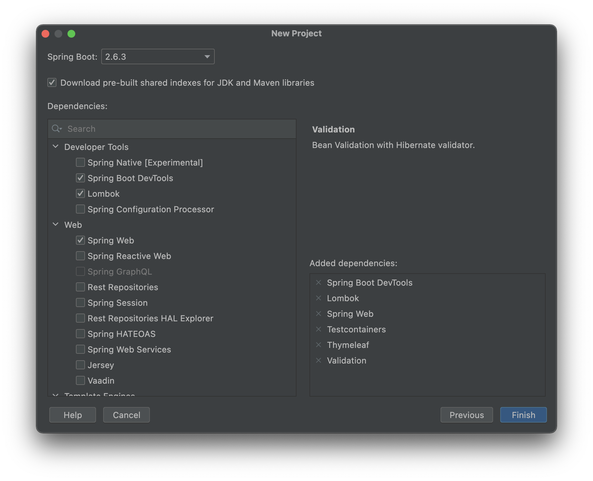

## Gumball Running on Localhost:8080
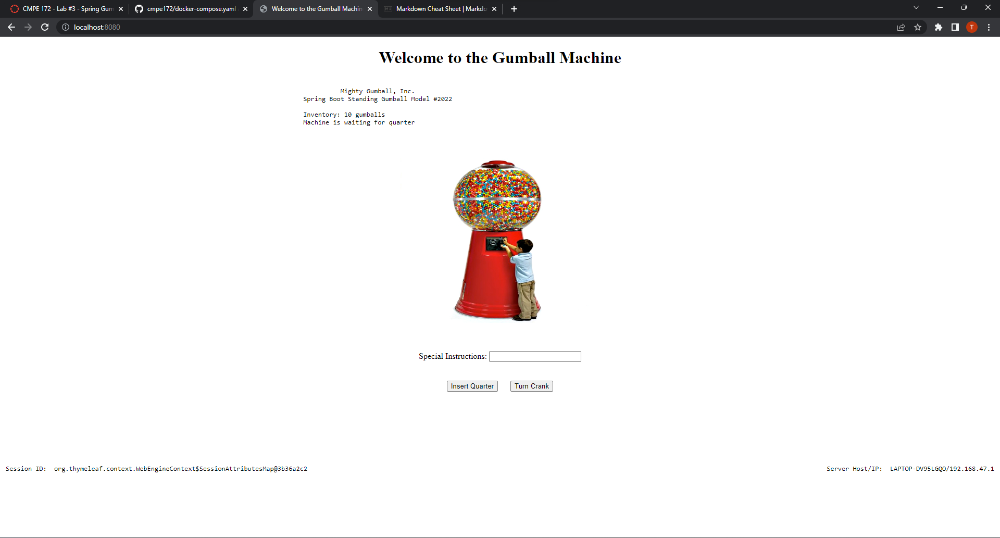
## Screenshots of deployment to Docker via Docker Compose
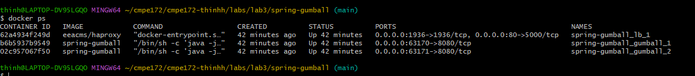
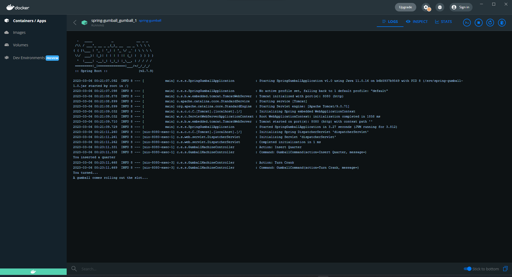
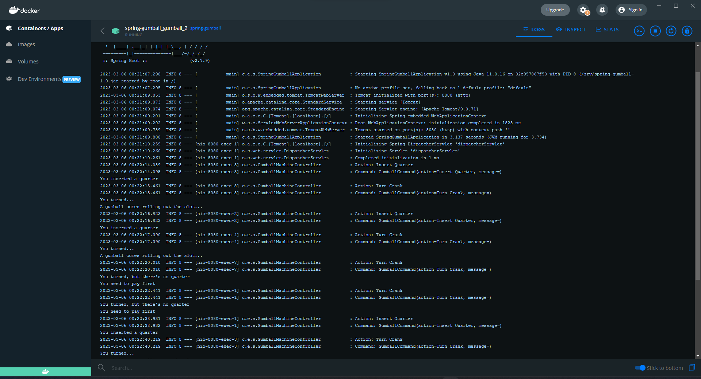
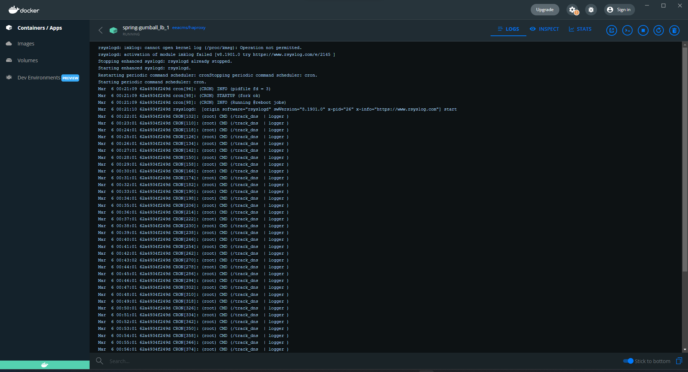

## HAProxy LoadBalancer Screenshot
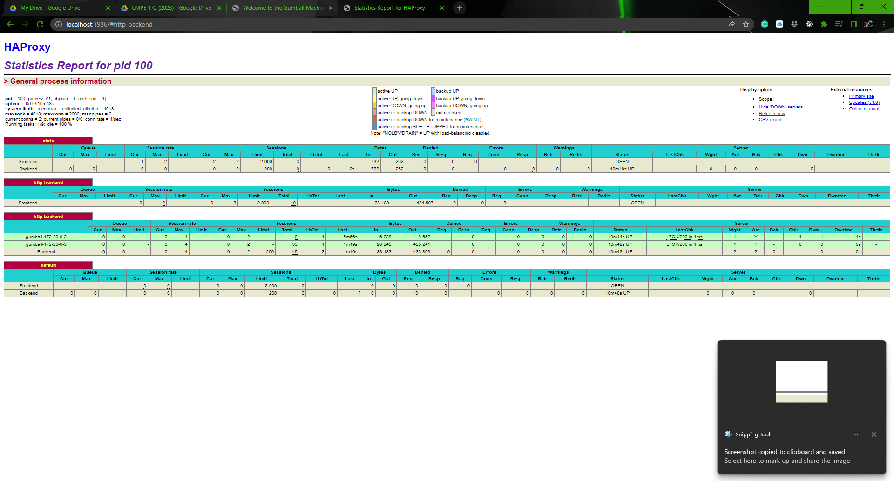

## docker network ls
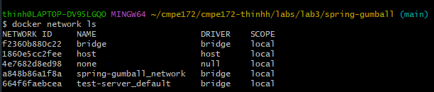

## docker network inspect
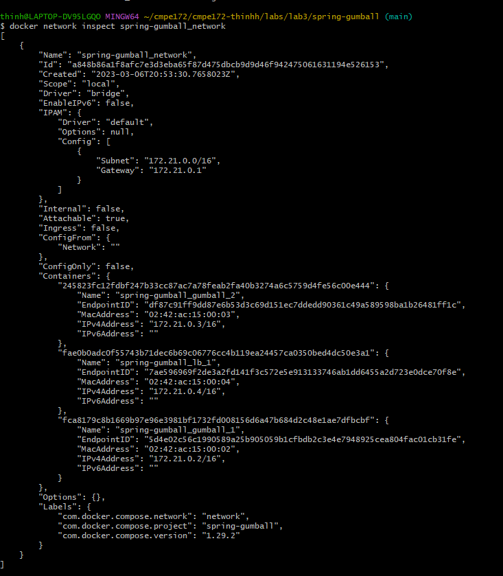

## Discussion 
1. When you load the page multiple times what do you see on the Gumball Home Pages for Server Host/IP?
- **When I tried to load the page multiple time, I see the value of Server Host/IP changed between the value of 172.20.0.2/3**  
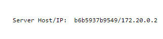
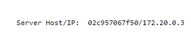
2. Can you explain where that IP value comes from? 
- **The first part of the IP address comes from the ID of the container and the second part is the IP address of the network**
3. Now, try to add some quarters and purchase some gumballs. 
Do you see the inventory depleting?  Are there any errors?
- **Yes, I can see the inventory depleting everytime I insert a quarter and turn the crank**
- **There was an error regarding of how we didn't change to sticky session as we switch over to load balancer for our second part of the lab**

4. Review to code for your answer.  No need to make any code changes to fix any issue. Look at the Session State Feature of the HA Loadbalancer (using COOKIES_ENABLED)
5. Is there a setting that can avoid the error?  Why does it work (or Why not).
- **Inside the docker-compose.yaml, we can change the value of COOKIES_ENABLED to true and that will fix the problem. By doing so, we will keep the state of our web from spilling as the load balancer round-robin the connection**

## Jumpbox Setup  
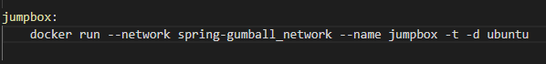
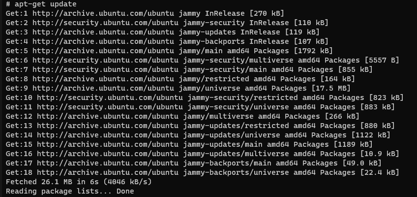
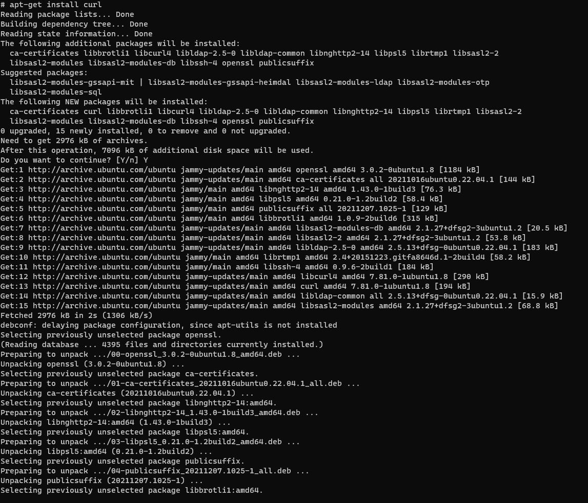
## curl localhost
### From local machine
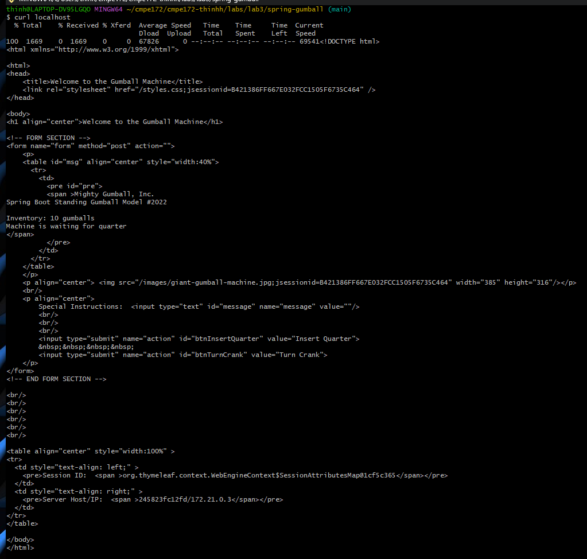
### From Gumball 1 container

### From Gumball 2 container

### Jumpbox Curl Gumball 1

### Jumpbox Curl Gumball 2
