# CMPE 172 - Lab #4 Notes

# Spring Security Screenshot
## Setup
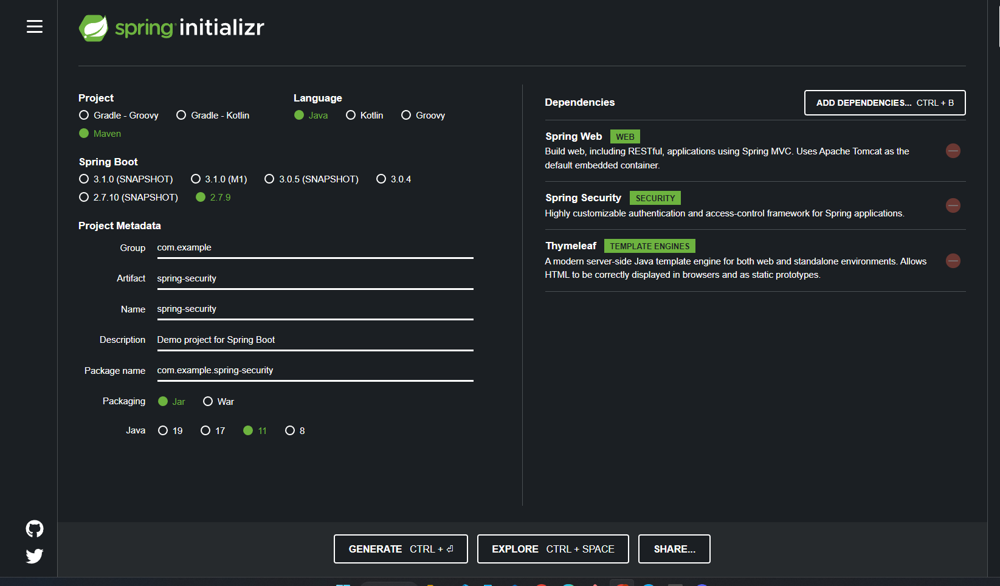

## Welcome
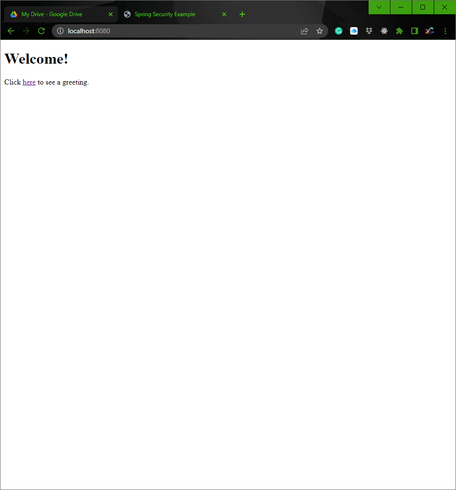
## Login 
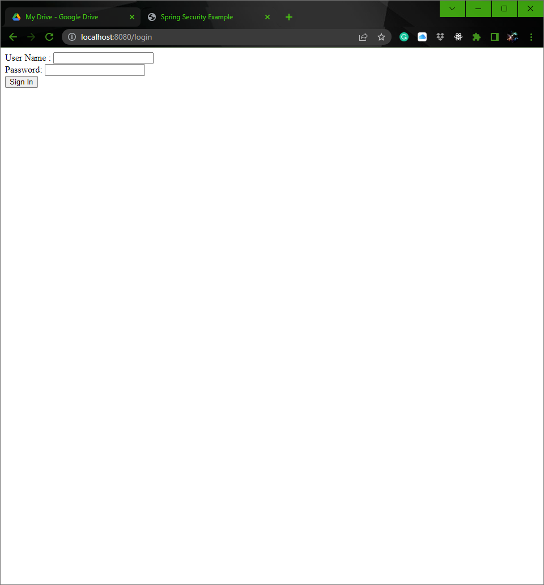
## Default user
- User: user
- Password: password

## Greeting 
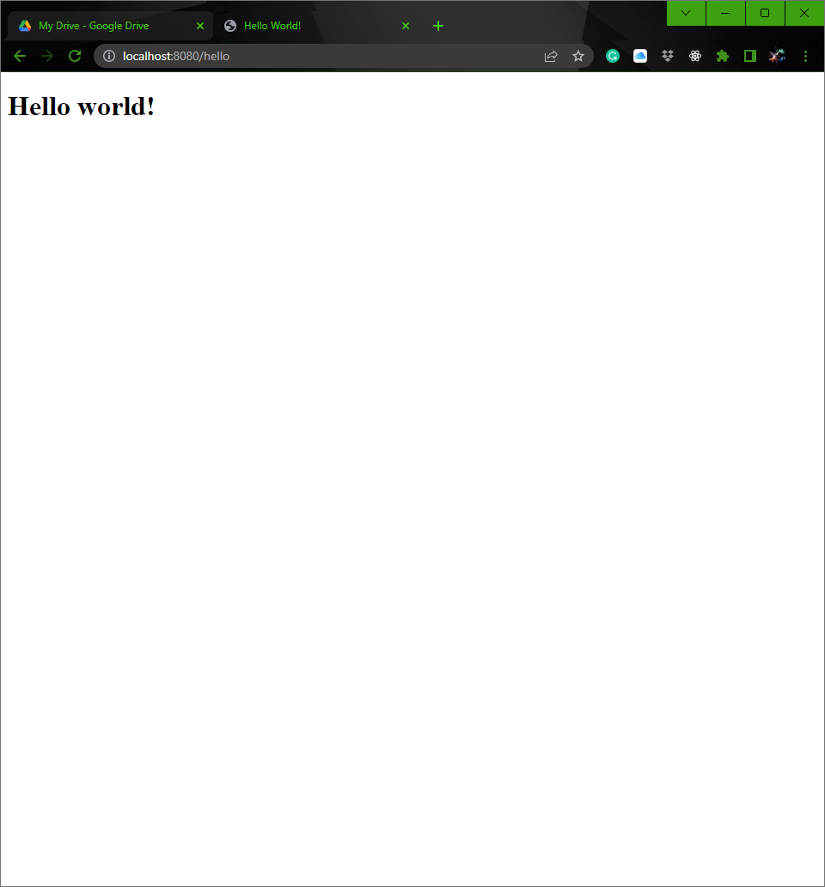
## Console 
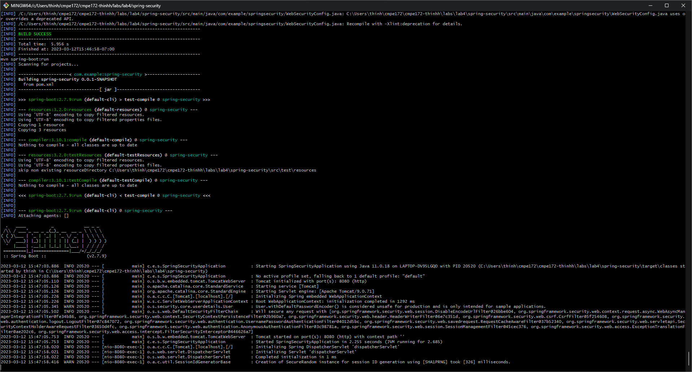
# Spring Gumball v2 Screenshot

## Setup
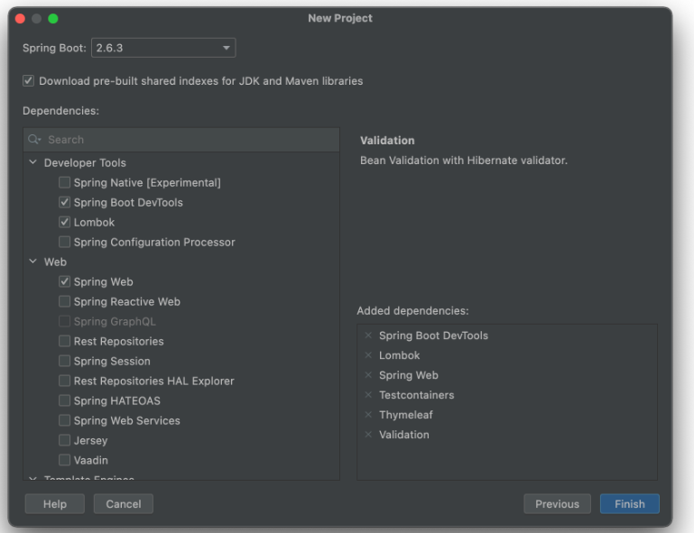

## Gumball with Hash
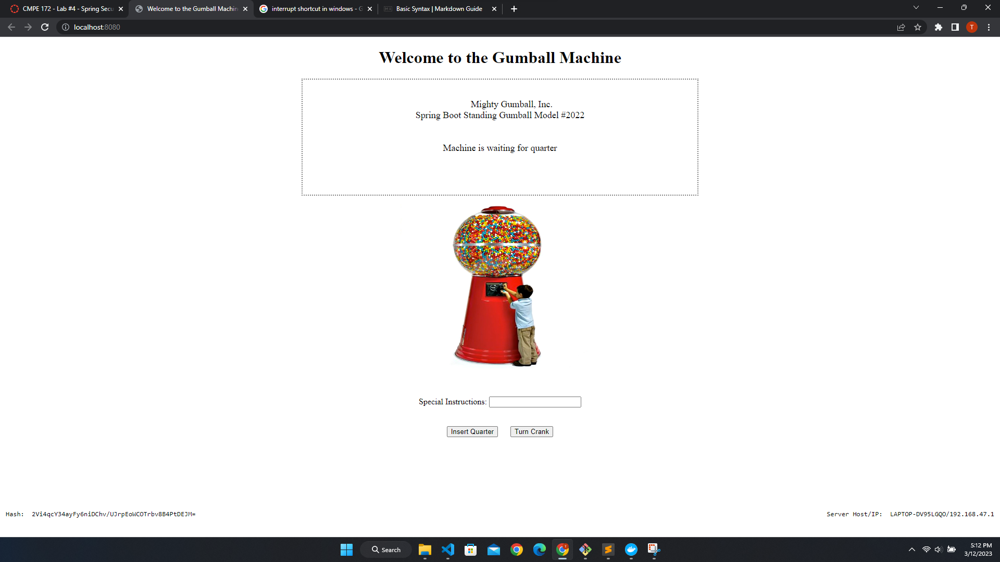

## Docker PS
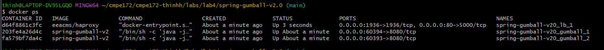

## Docker Deployment Detail
### <code>docker network ls </code>
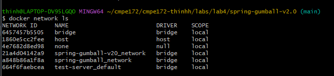

### <code>docker network inspect spring-gumball-v20_network</code>
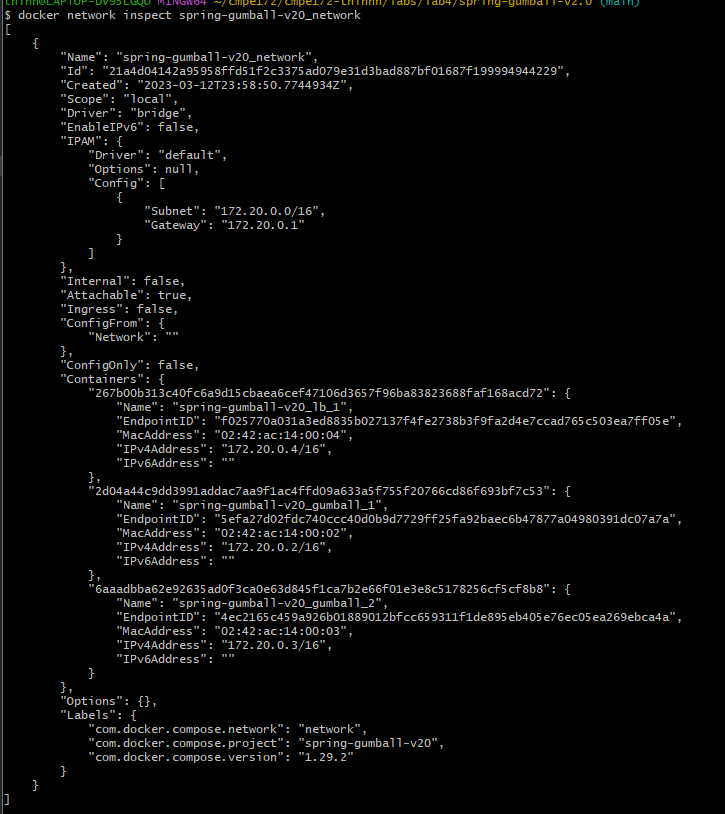
## Discussion
- Do you see any errors that were observed in Spring Gumball (Version 1)? 
 
There is an error regarding null pointer to the session in GumballMachineController
that is similiar to version 1 when we tried to put on the use http session for version 2. The fix in version 1 was to make the session sticky when we used the load balancer. But for version 2, we want to make the web state-less. 

- Why or Why Not?  Explain the technical details to support your observation.
 
This error is cause by our decision to make the website state-less by leaving out the <code>import javax.servlet.http.HttpSession; </code> and store the state on the client browser. A simple fix was to not call on the http session and change the way on how we create the gumball object. 

#  Spring Gumball Replay Attack 
## Before (without the use of hash key)
### Browser before the interrupted message sent
Turn crank without putting a quarter
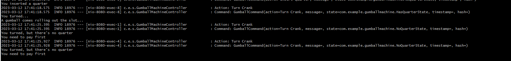
### Console after the interrupted message sent
Interrupt message and modify
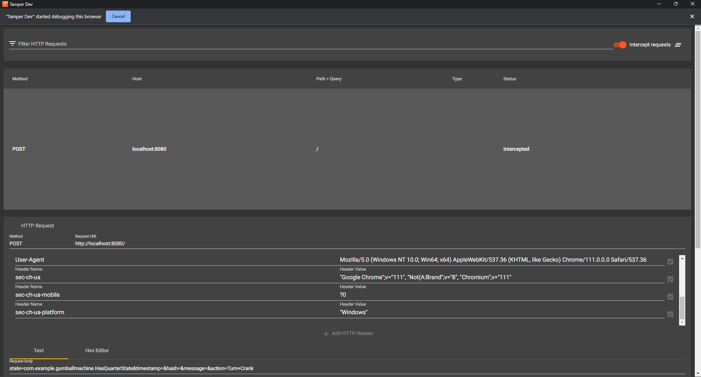
Without putting in a quarter, still get a gumball
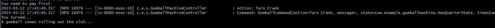
## After (with hash)
### Browser after the interrupted message sent

### Console after the interrupted message sent
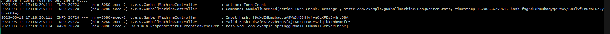
