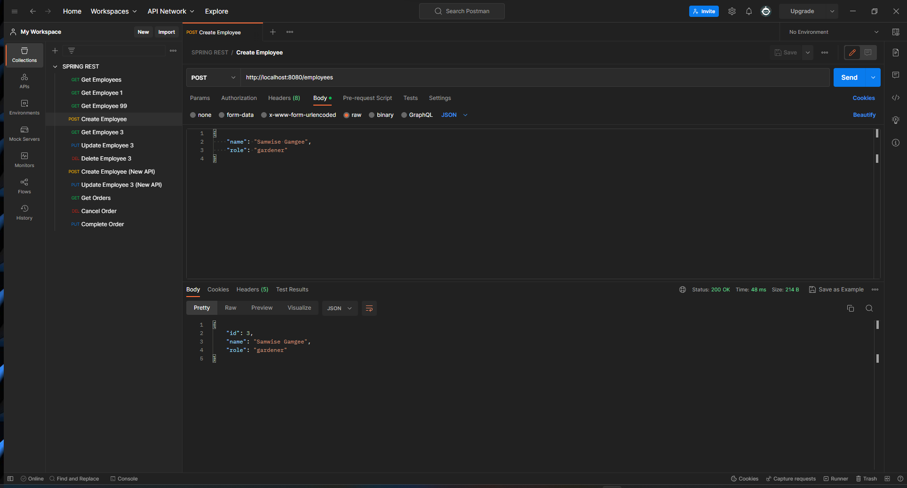
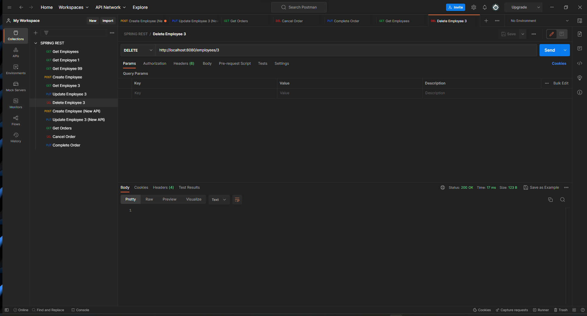

# CMPE 172 - Lab #5 Notes
# Spring-Rest-Level2
## Console 

## H2 Console 

## Get Employee

## Get Employee 1

## Get Employee 99

## Create Employee

## Get Employee 3

## Update Employee 3

## Delete Employee 3

## Create Employee (New API)

## Update Employee 3 (New API)

## Get Order

## Cancel Order

## Complete Order

# Spring-Rest-Level3
## Console

## H2 Console

## Get Employee

## Get Employee 1

## Get Employee 99

## Create Employee

## Get Employee 3

## Update Employee 3

## Delete Employee 3

## Create Employee (New API)

## Update Employee 3 (New API)

## Get Order

## Cancel Order

## Complete Order
