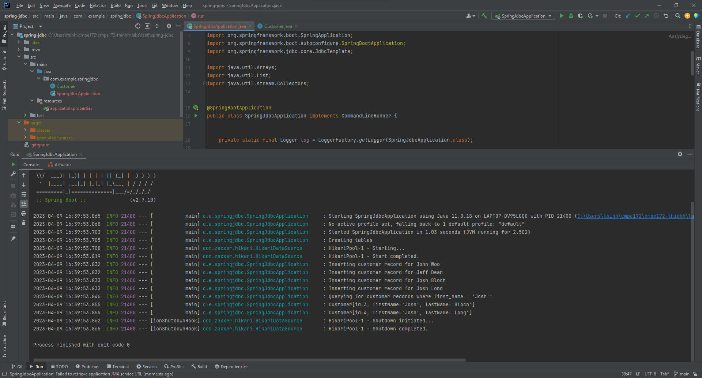
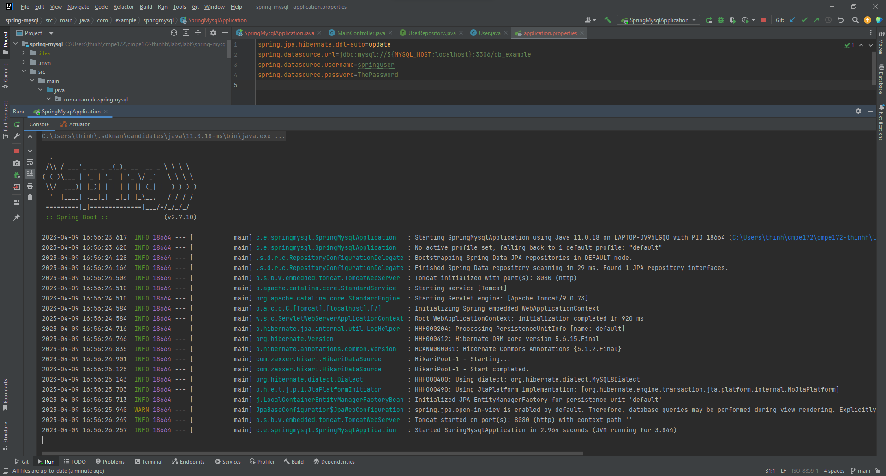
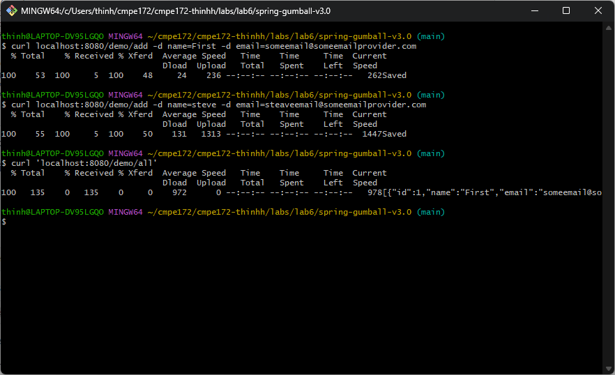
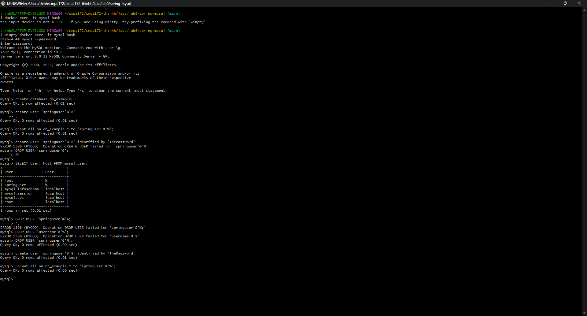
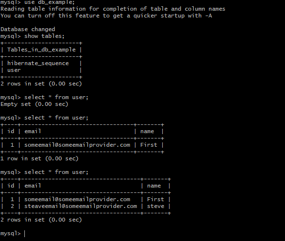
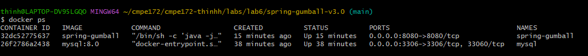
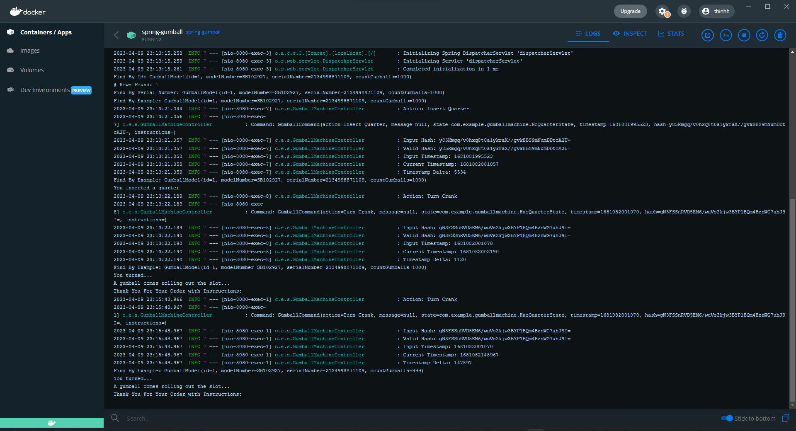
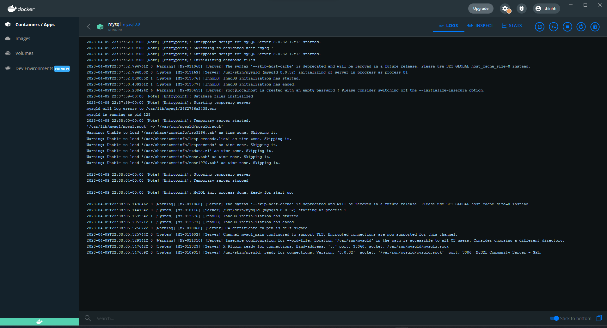
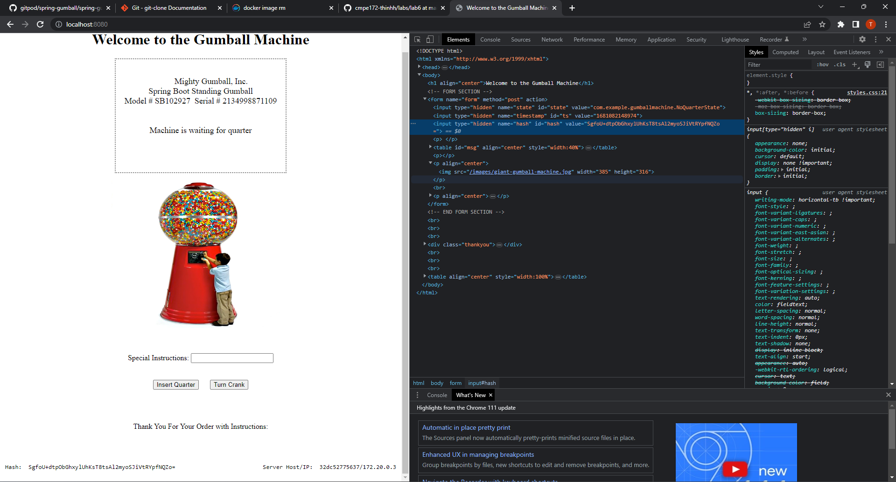
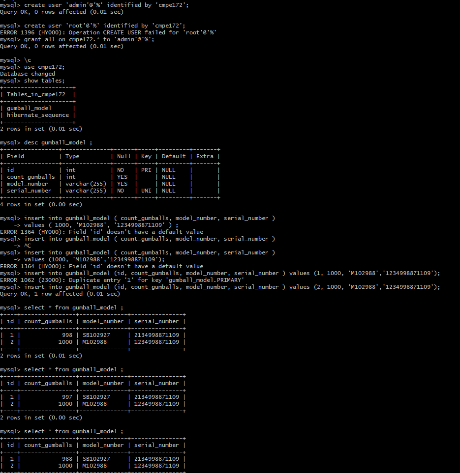

# CMPE 172 - Lab #6 Notes
# Spring JDBC

# Spring MySQL

# Spring Gumball v3

# Discussion
- Spring-JDBC: Work as intended and showed in screenshot above
- Spring-MySQL: Made a mistake in create springuser with the assign password "ThePassword". Had to read over how to drop existing user and create a new springuser with the correct password in order to connect into MySQL. Screenshot of MySQL Query and Spring Console provided above. 
- Spring-Gumball-v3: Followed the instruction on Canvas. SQL Query, console, Docker PS and all screenshots are provided above. 