# CMPE 172 - Lab #7 Notes
# Cybersource
## Console
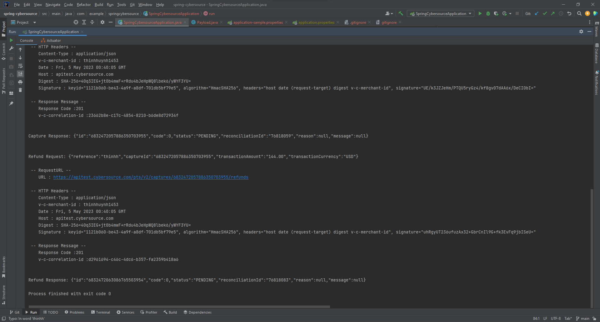
## Dashboard
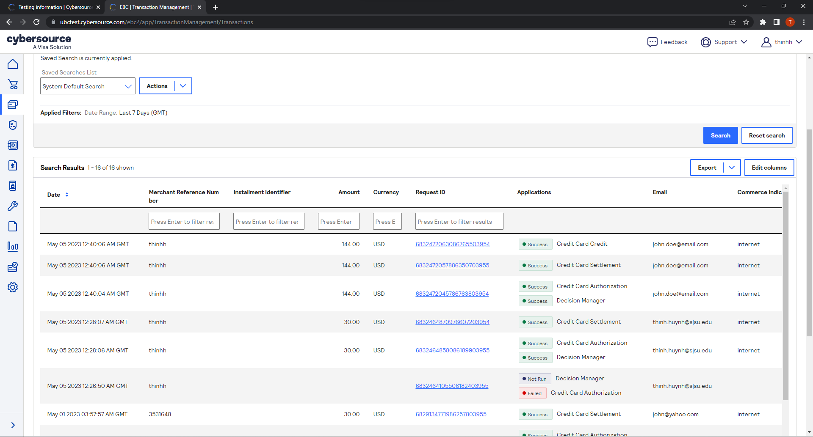

# Spring Payment
## Payment Page
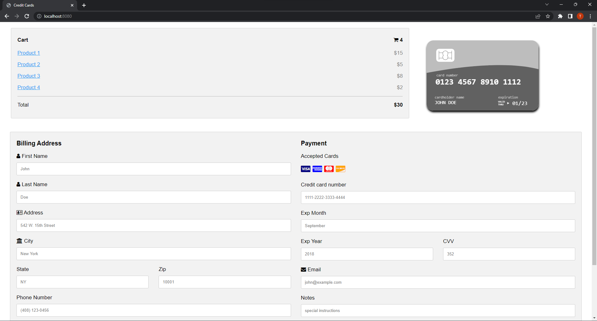
## Missing Field
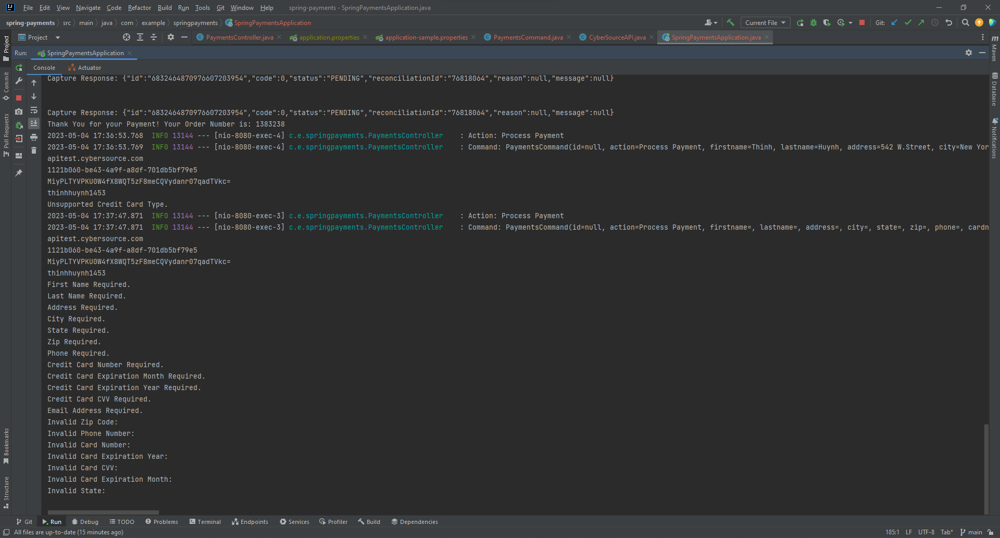
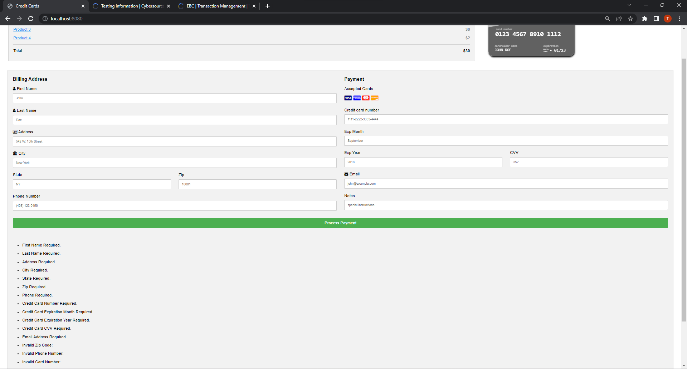
## Unsupported Card
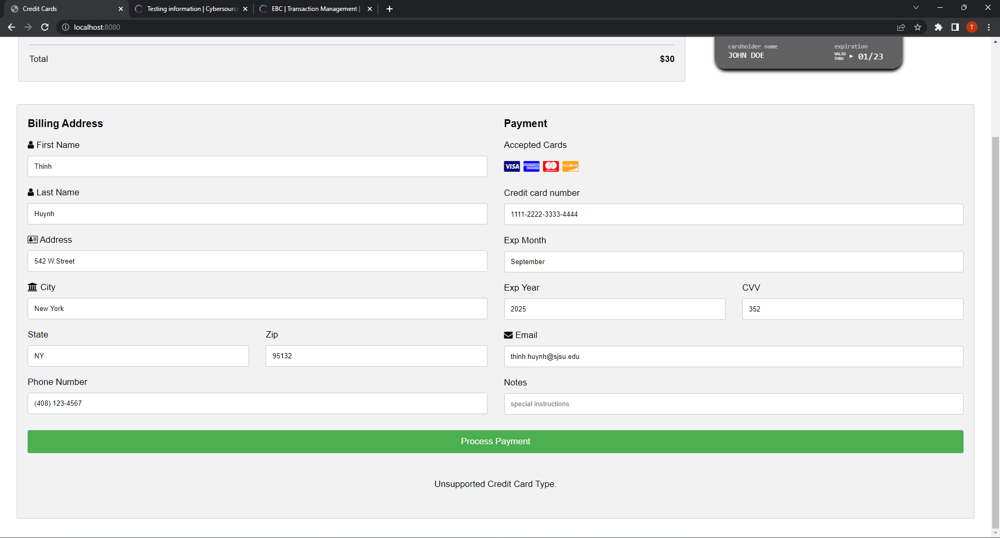

## Console
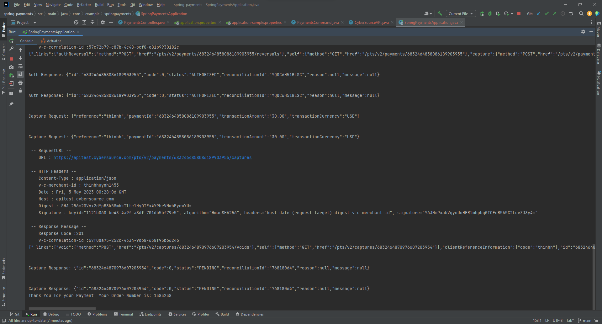
## Accepted Payment
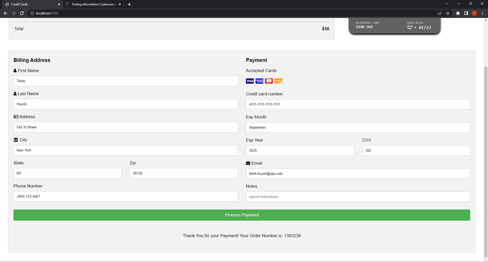
## Cybersource Dashboard
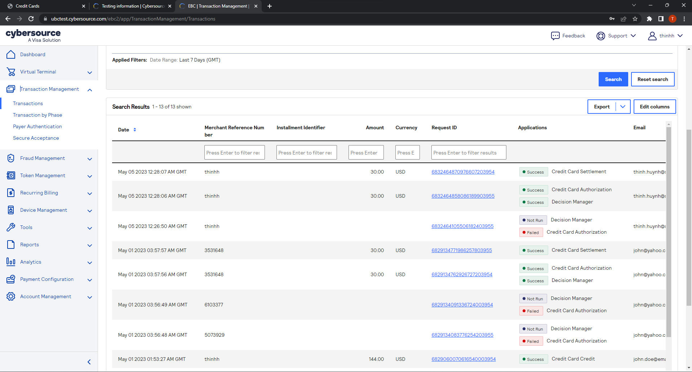

## MySQL terminal
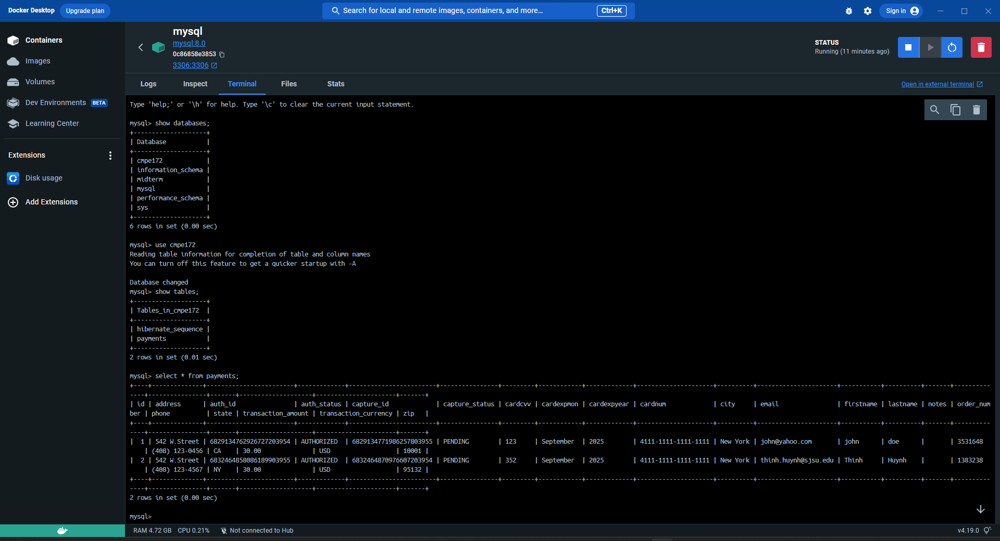

# Discussion
- Discussion of the Lombok, ThymeLeaf and Spring Features you used in this Lab.  
    Lombok is used in the PaymentCommand with the use of @Data. This will automatically generate @Getter,@Setter, @ToString, @EqualsAndHashCode and @RequiredArgsConstructor annotations on the class. So we don't have to manual write it  
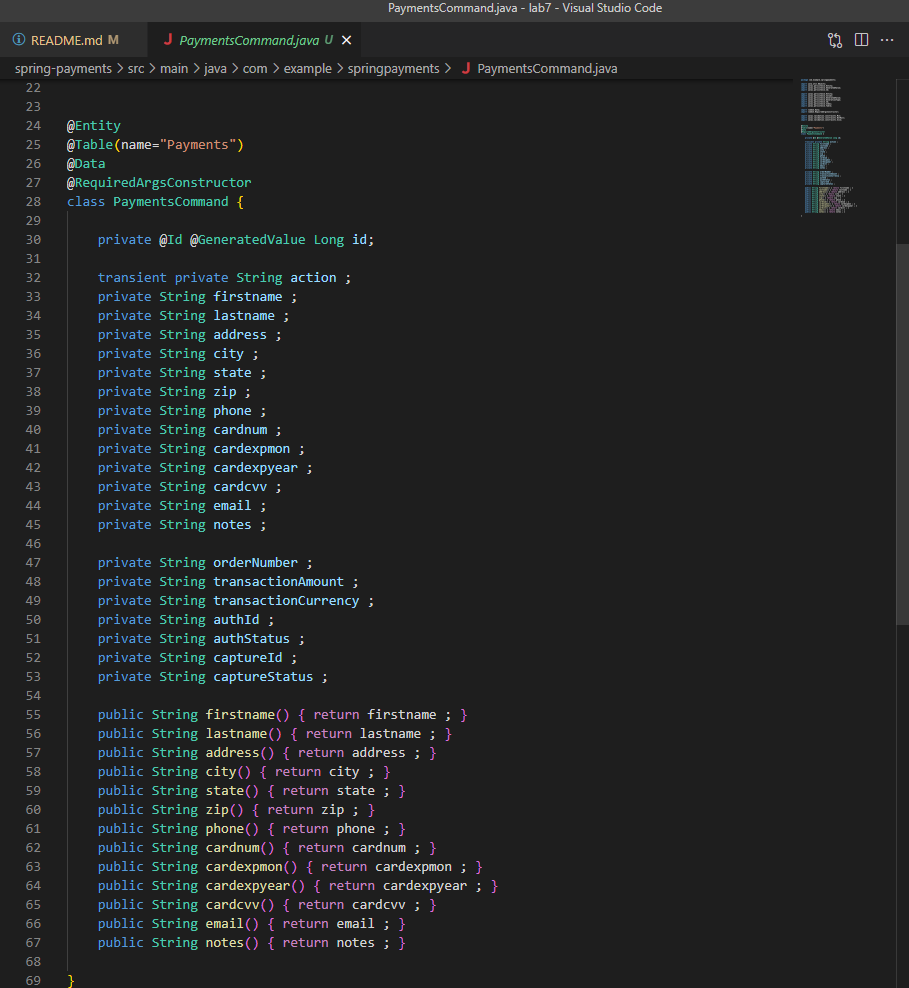
    Thymeleaf is used in the templates, creditcards.html. Thymeleaf is used to pass the user input to the backend server as a command with properties of  respective fields as firstname, lastname, cardnum, etc... 
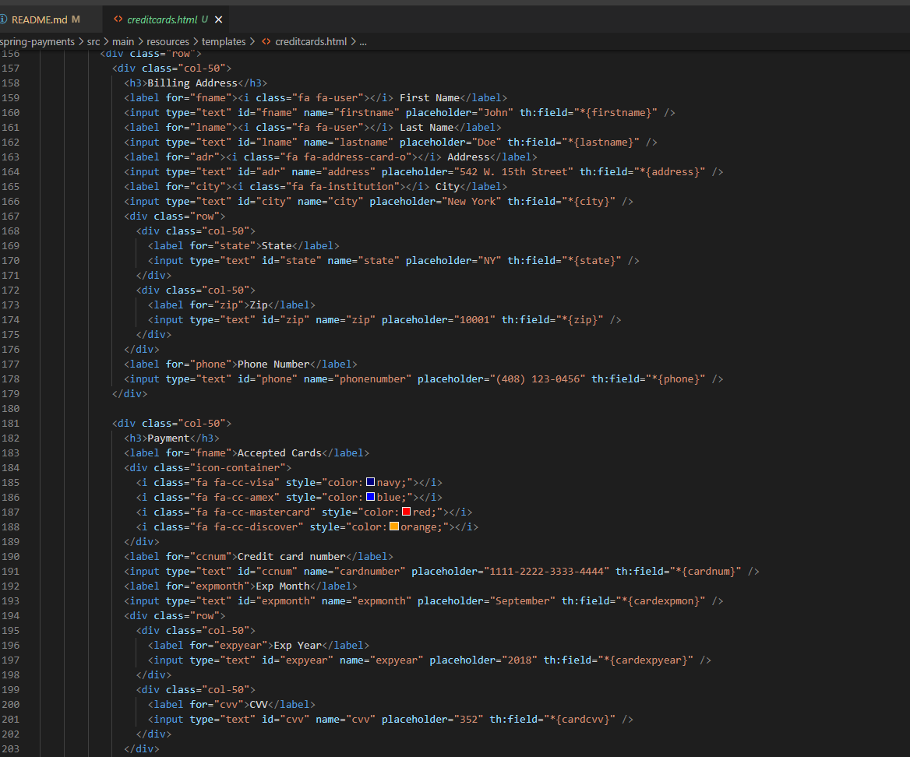 
- Discuss why Jackson is needed and where it is used in the code for this Lab. 
    Jackson is used to serialize/deserialized json response to java object. In this lab, Jackson is used in the Cybersource, AuthResponse/CaptureResp/RefundResponse. For this files, jackson capture the response from cybersource and deserialize the response into ids, check for the status, and display the error message.
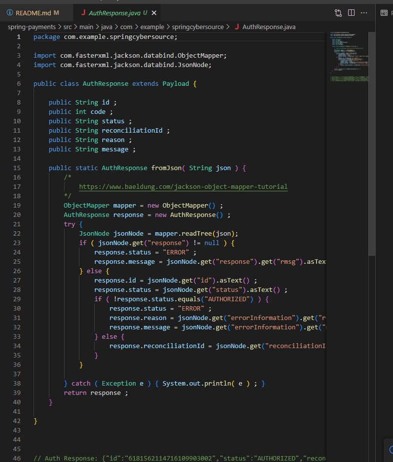
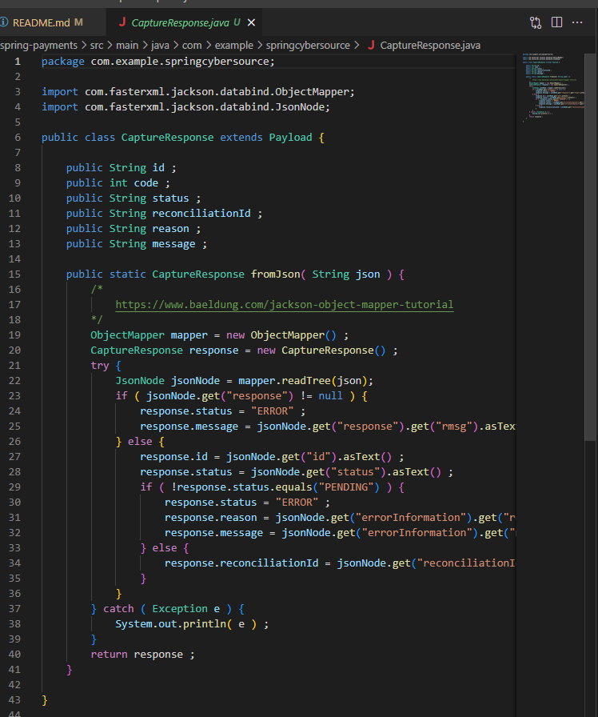
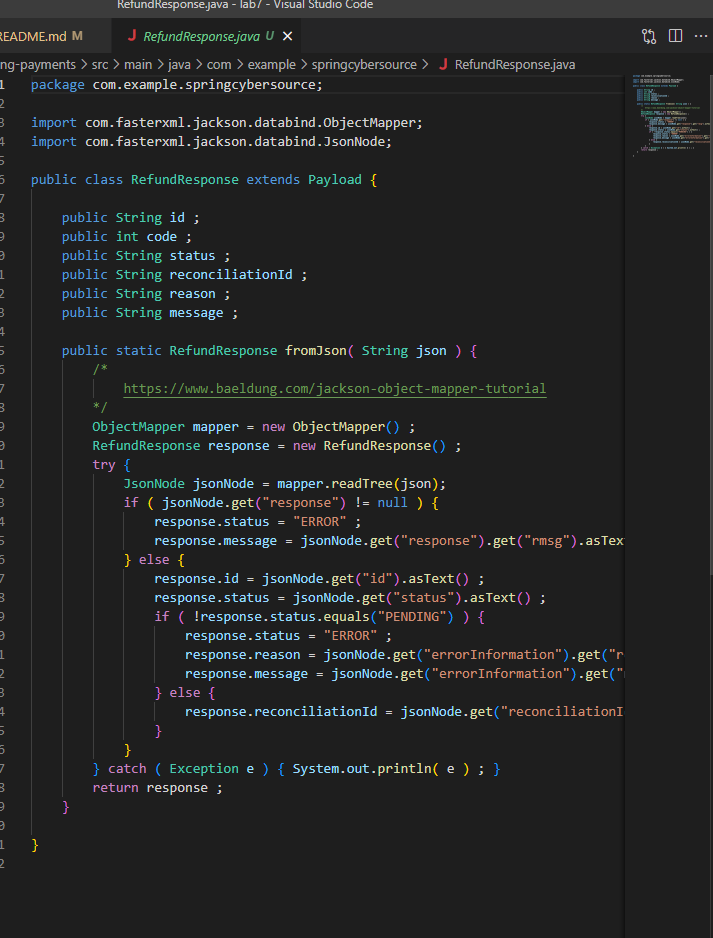