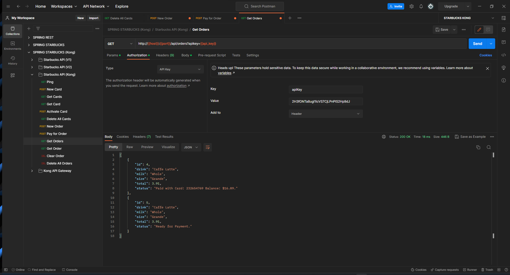

# CMPE 172 - Lab #8 Notes
# KONG API on POSTMAN
## KONG console

## STARBUCK API

## POSTMAN 

# KONG API GKE

# Discusion 
- Any challenges you face while working on this lab (i.e. GKE deployment issues) and how you overcame / solved them.  
 1. Unable to download httpie / Solution use cURL instead
 2. Misunderstood about the image push to docker with wrong name/ Solution: Log on to my docker and check the image name in the repo that I pushed.
 3. Using incorrect docker command to push my image / Solution: Go to docker page to check the requirement to push the image. Turn out I was missing the -t for tag
 4. Using wrong port for service, unable to ping starbucks-api/ Solution: recheck the port on GKE
 5. Unable to create ingress because different version takes in different parament name for ServiceName and ServicePort /Solution: turns out to be service.name and then service.port.number.  
     
- A discussion of what changes would be needed in order to deploy your Starbucks API with MySQL / Cloud SQL.  
    In order to deploy mySQL, I need to include mysql in the project application.property. Create the mySQL with specific setting on GKE. And then create a SESSION schema for jdbc on GKE.   