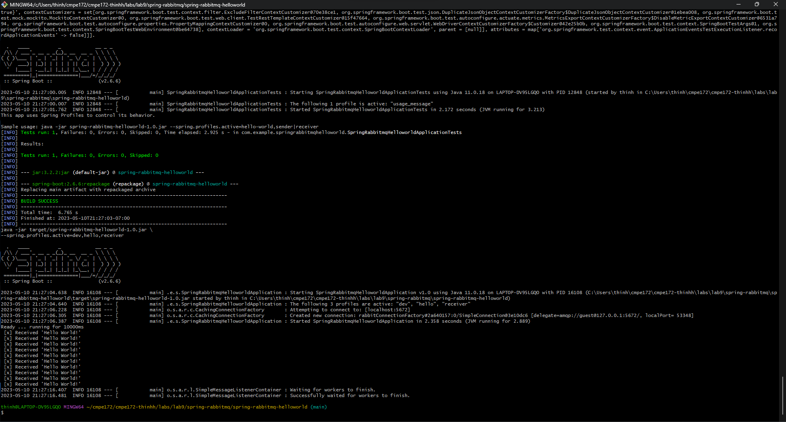

# CMPE 172 - Lab #9 Notes
## Spring-RabbitMQ

## Spring-RabbitMQ-HelloWorld

## Spring-RabbitMQ-Workers

## Discussion
- A discussion of what Spring Profiles are and how they can be used in your Project  
    Spring Profiles are a core feature of the framework — allowing us to map our beans to different profiles — for example, dev, test, and prod. Spring Profiles can be use to active @Bean that only be use in development but not for production. We can use profiles to hide what we don't want other people to see for our production  

- A discussion of how RabbitMQ can be used in your Project (i.e. what's the use case?)  
    RabbitMQ can be use to send orders from the client side to the backend cashier for processing the payment. 
    Multiple orders can be placed on a queue while waiting for the backend to process each order. 