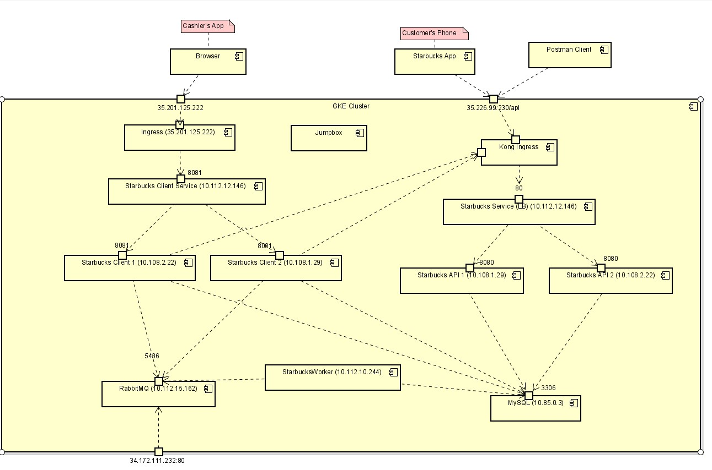

# CMPE 172 Project Journal
## April 24, 2023
Watch the Project Demo End-to-end

## May 1, 2023
Worked on converting starbuck-nodejs to Spring MVC. DONE  
## May 8
Finished Spring Payment Lab. Learned how to intergrate payment in Starbucks
## May 10 
Finished Kong-APi Lab. Learned how to integrate and deploy Kong API gateway on GKE  
Finished RabbitMQ Lab. Learned how to integrate RabbitMQ  
Watched previous Starbuck Demos for reference
## May 11, 2023
### 9:00AM to 12:00 am
Worked on create new user and user login for spring-cashier. DONE
Added new user into MYSQL. 
### 12:00 am - 1pm
Work on creating drink options  
Watched demos  
### 6pm -12pm
Finished working on drink option  
Watching demos

## May 12, 2023
Working on connecting Starbuck Cashier to API. In-progress  
Working on checking KONG Connectivity. In-progress
 
## May 15, 2023
Added error page for HTTP Bad Request  
Added NEW ORDER, NEW CARD, ACTIVE CARD, PAY Feature

## May 17, 2023
added Kong API on Docker Compose and Check Connectivity  
Watched video for RabbitMQ and GKE demo

## May 18, 2023
Kong API connection on Compose (Done)  
Adding RabbitMQ dependency and adding Starbuck Worker  
Working on creating the Astah Architectural Design
Added RabbitMQ sender (DONE)  
Added "PAID" order into a "order_drink" MYSQL  
Working on RabbitMQ worker  

## May 19, 2023
Finished Architecture Diagram (DOME)  
Finished Docker Compose (DONE)  
Finished adding workers and RabbitMQ to DockerCompose (DONE)  
Docker Compose Stack worked as intended (DONE)  
Working on Deployment for GKE and watch demo for GKE Deployment  

## May 20, 2023
Docker Containerize Spring-Cashier, Spring-API, Spring-Cahsier-Worker
Created MYSQL Cloud

## May 21, 2023
Project Deployed on Kubernet (DONE)  
Working on the Report/Journal
# Starbucks Architecture On Docker Compose

# GKE Screenshot

# Starbucks Workflow
