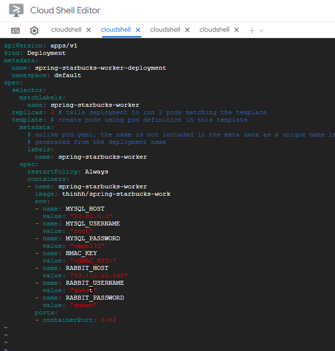
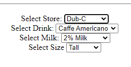

# CMPE 172 Project Journal
## April 24, 2023
Watch the Project Demo End-to-end

## May 1, 2023
Worked on converting starbuck-nodejs to Spring MVC. DONE  
## May 8
Finished Spring Payment Lab. Learned how to intergrate payment in Starbucks
## May 10 
Finished Kong-APi Lab. Learned how to integrate and deploy Kong API gateway on GKE  
Finished RabbitMQ Lab. Learned how to integrate RabbitMQ  
Watched previous Starbuck Demos for reference
## May 11, 2023
### 9:00AM to 12:00 am
Worked on create new user and user login for spring-cashier. DONE
Added new user into MYSQL. 
### 12:00 am - 1pm
Work on creating drink options  
Watched demos  
### 6pm -12pm
Finished working on drink option  
Watching demos

## May 12, 2023
Working on connecting Starbuck Cashier to API. In-progress  
Working on checking KONG Connectivity. In-progress
 
## May 15, 2023
Added error page for HTTP Bad Request  
Added NEW ORDER, NEW CARD, ACTIVE CARD, PAY Feature

## May 17, 2023
added Kong API on Docker Compose and Check Connectivity  
Watched video for RabbitMQ and GKE demo

## May 18, 2023
Kong API connection on Compose (Done)  
Adding RabbitMQ dependency and adding Starbuck Worker  
Working on creating the Astah Architectural Design
Added RabbitMQ sender (DONE)  
Added "PAID" order into a "order_drink" MYSQL  
Working on RabbitMQ worker  

## May 19, 2023
Finished Architecture Diagram (DOME)  
Finished Docker Compose (DONE)  
Finished adding workers and RabbitMQ to DockerCompose (DONE)  
Docker Compose Stack worked as intended (DONE)  
Working on Deployment for GKE and watch demo for GKE Deployment  

## May 20, 2023
Docker Containerize Spring-Cashier, Spring-API, Spring-Cahsier-Worker
Created MYSQL Cloud

## May 21, 2023
Project Deployed on Kubernet (DONE)  
Working on the Report/Journal
# Starbucks Architecture On Docker Compose

# Starbucks Architecture on GKE

# GKE Screenshot
## Deployment on GKE 

## External IP for Spring Cashier IP: http://35.201.125.222/
## External IP for Spring API IP: http://35.226.99.230/api (Need to Provide API Key for Kong)
## External IP for RabbitMQ: http://34.172.111.232/
## GKE PODS Running

## Cashier App
- Support Admin Logins for Starbucks Employees (5 points) -- (must not store in memory or hard code in source code, must support new account registration and logout) 

- Cashier's App - Cashiers App Deployed and running on GKE PODS (2 points) 

- Cashier's App - Supports Order Selection - Dring Type, Size, Milk Option (3 points) 
- Cashier's App - Rendering must use MVC by processing REST API calls from Starbucks API via Kong Gateway on GCP (5 points)
- Cashier's App - Order Created via REST API call to Kong Endpoint with API key running on GCP (5 points)  

- Cashier's App - Order Payment Reflected on UI with Updated Balance Paid by Mobile App (5 points)

## GCP Cashier App LB
- GCP Cashier's App LB - External IP of Load Balancer used for Demo/Screnshots of Cashier's App (1 point)  
External IP for Spring Cashier IP: http://35.201.125.222/
- GCP Cashier's App LB - Evidence of Load Balancer with Heahtly Backends on GCP / GKE (2 points)

## GCP Starbucks API Internal LB 
- GCP Starbucks API Internal LB - Evidence of Healthy Running Starbucks API Pods in GKE (2 points)

- Starbucks API Internal LB - Evidence of Reachability Tests via Ping API call with Kong API key to Service Endpoint (10 points)  
Using cUrl in Jumpbox to test internal connectivity. Using the internal IP of Kong-proxy to test, 10.112.13.71 (KONG) and  10.112.12.146 (Service LB)

## MySQL Cloud SQL
- MySQL Cloud SQL - Evidence of Running MySQL Instance on Cloud SQL (5 points)

- MySQL Cloud SQL - Evidence that MySQL IP is used by Cashier's App to Persist Order Data (Spring JPA Requirement) (5 points)

- MySQL Cloud SQL - Evidence that Data Stored in MySQL DB cooresponds to Data visible on Web UI (5 points)

This Screenshot was taken before PAID so the status might be a little different but it still the same info.

## RabbitMQ
- RabbitMQ - Evidence that RabbitMQ is Deployed in GKE or GCP and used in Project via changes to Spring Source Code (10 points)
  
Changes in Client to intergrate RabbitMQ to send order  
Added send to rabbitmq when press get-order  
  
Changes in Worker to intergrate RabbitMQ to receive order  
Worker listening on starbucks queue
 
I am only highlight the important changes but the rest of the source code change was pushed to github
- RabbitMQ - Evidence via Demo/Screenshots that the Functionality Works (i.e. via CURL or Postman Tests and Logs or RabbitMQ Console) (15 points)

## Mobile App Kong Connection
- Kong Connection - Moible App should be connected to Starbucks API via Kong using API key (demo'ed during startup of Mobile App) (10 points)
- Kong Connection - Cashier's App and other Apps in Demo must connect to Starbucks API via Kong using API Key (5 points)
- Kong API Auth - Source code for Apps shows evidence that REST API requests are using API Key Auth (5 points)  
For mobile: the API Host URL is embeed during the Launch  
  
For Cashier: The API HOST is embeed through deployment yaml  
  

For Cashier Source Code: The API URL HOST and API KEY was passed from the application property and used in the code

# Discussion: 
- How does your Solution Scale?  Can it handle > 1 Million Mobile Devices? Explain.  
    In the deployment-COMPONENT.yaml, there is a section for replicas in which we can replicate multiple of the same instance by changing just that one line before deploy. If we already deployed, we can go to the pod YAML section and change it directly from there. The pod will be terminate for couple minute in order to load the new setting in. So yes, I think the solution can handle 1 million device if I replicate my Starbuck API to meet the demand. 
# Starbucks Workflow

## Enter Pin and Register New Card on Startup

## New Card Create on MYSQL Cloud and Postman Check

## Place an Order on Cashier App

## Select Card and Pay For Order
Touch(2,2) to paid

- And this is the rabbitMQ activity chart for order thata was paid and get pick up by workers
  
Worker Pod Log  

I tried to push the same order multiple time because I couldn't catch the MYSQL change the first time so that explain the multiple process order of the same order-number

# Demo
- Shorter Youtube Link: https://youtu.be/kE-Xyy-sJRU  
Explannation: Sometimes there are black screen because I had to pause the recording to find my stuffs, read the requirement, and rerun the jumpbox pod because sometimes it crashed. 
# Project Journal with Weekly Status Reports to include
- A discussion of your accomplishments that week with a list of links to your Code Commits and PRs.
    5/1 - 5/8: Figuring out the over architecture and doing some prep work like porting node.js to Spring, create mysql, create rabbit image
    5/8 - 5/15: Working on the Cashier App and the Project on Docker using docker-compose to create a starbucks workflow 
    5/15 - 5/22: Completed the project on Docker Compose and containerize and deploy them onto GKE. Writing reports for submission. 
- A discussion of the challenges you faced that week and how your resolved those issues.
    1. Struggling to understand the overall architecture of the project. Solution: Continue watching the demo until I figure out the Structure.
    2. Struggling to get the project to worked on Docker Compose first. Solution: Keep rewatching the demo until I finally understand
    3. Struggling to containerize the Docker Image to Docker Hub. Solution: Go on docker to read about how to tag an existing image with (your-account)/image-name and then push to your docker hub
    4. Struggling connecting port and understand how kubernet works. Solution: Read tutorial about Kubernet and watch Gumball Demo and tried to follow that structure
    5. Struggling on how to make KONG API works on GKE. Solution: Following the Lab 8 Demo to make Kong Ingress with External API and connect the containers inside the cluster using the cluster IP
    6. Struggling on troubleshooting the project on GKE when there is an error. Solution: Take the error pod down and re-do the entire deployment
